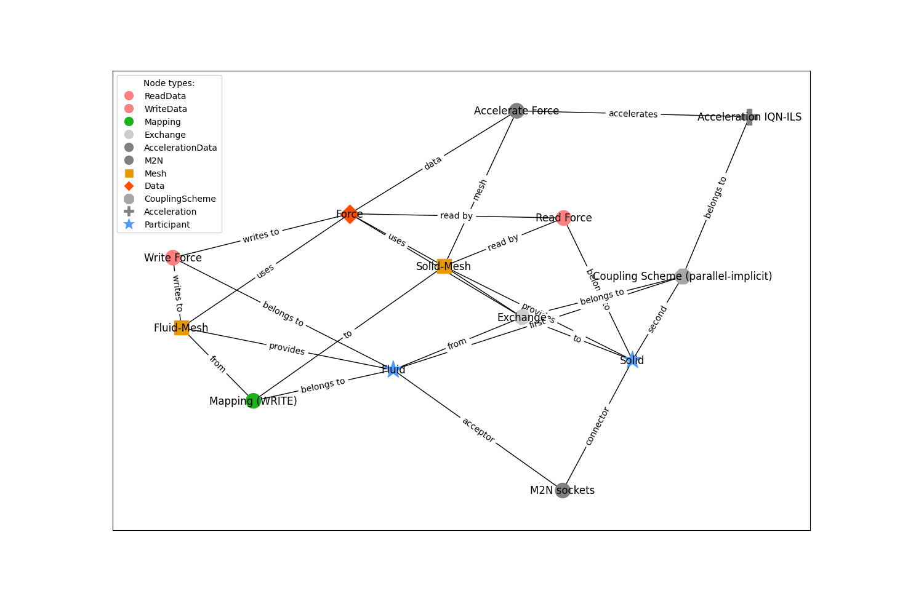
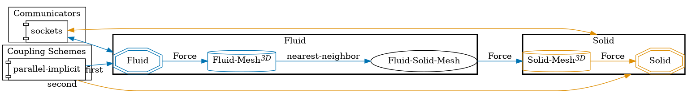

This examples represents the most basic configuration. It was directly inspired by preCICE's workshop example for beginners to start learning preCICE.

Since it contains only a uni-directional data exchange and only data point, its not a fully functional configuration. 

Inspired by: https://github.com/precice-forschungsprojekt/precice-generate/pull/55 and propably https://precice.org/configuration-coupling-mesh-exchange.html#example-configuration

