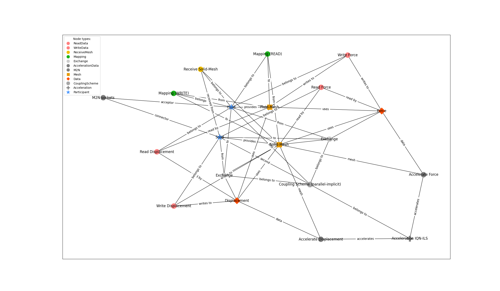
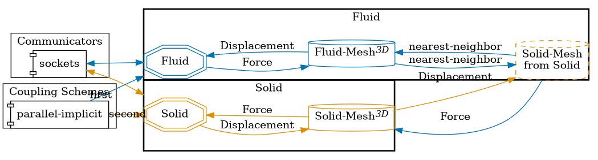

This is a standard and very basic example of a preCICE configuration with 2 participants and simple bi-directional data exchange.

The coupling scheme uses standard display values for properties like max-time, etc.

Inspired by: https://github.com/precice-forschungsprojekt/precice-generator/pull/55 and propably https://precice.org/configuration-coupling-mesh-exchange.html#example-configuration

