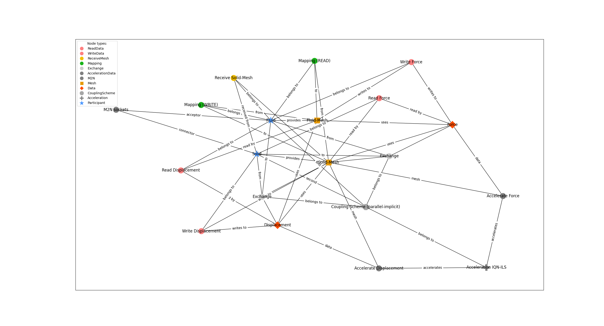

This example is an extension to example 1 since it uses specific, manually set, properties for coupling, like max-time and time-window-size. 

Inspired by: https://github.com/precice-forschungsprojekt/precice-generator/pull/55 and propably https://precice.org/configuration-coupling-mesh-exchange.html#example-configuration

