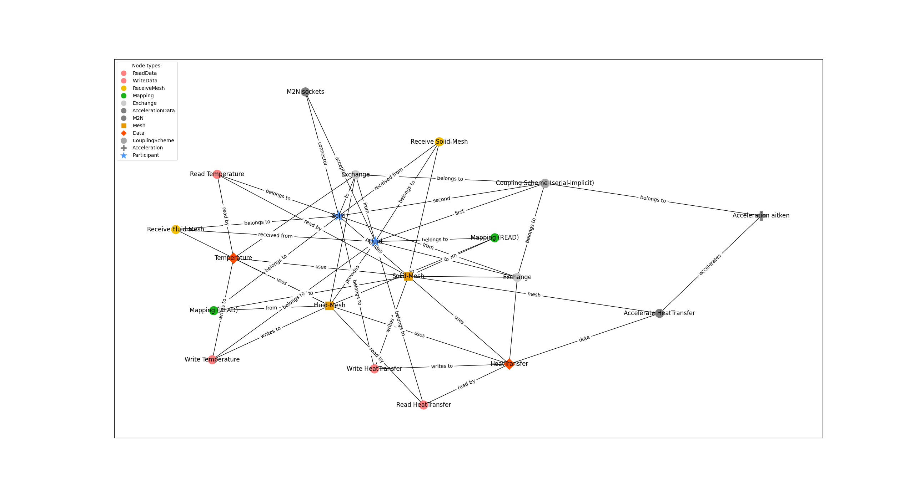
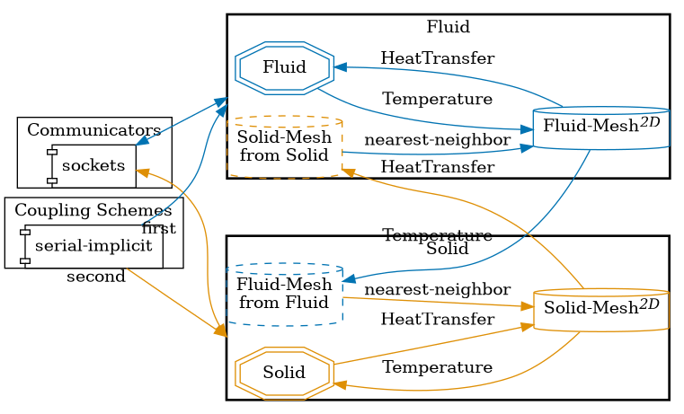

This is a first example with more complex structure.

1. It uses manually set couling-scheme properties, like max-time and coupling.

2. It defines dimensionality of each participant.

3. It manually defines acceleration to be used in the config.

Inspired by: https://github.com/precice/tutorials/tree/master/flow-over-heated-plate-partitioned-flow

