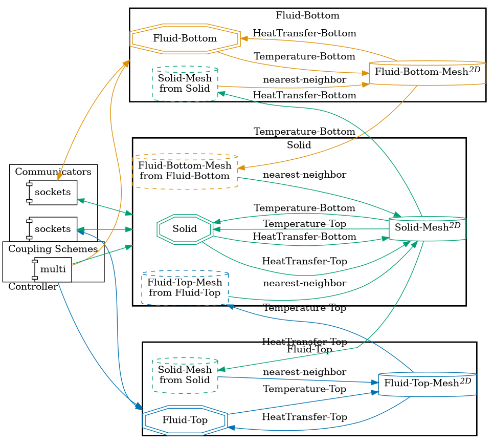

This example presents a much more complex configuration, with 3 different participants and more complex naming conventions like 'Fluid-Top" instead of just 'Fluid'. It also contains more exchanges. 

Inspired by: https://github.com/precice/tutorials/tree/develop/heat-exchanger-simplified

