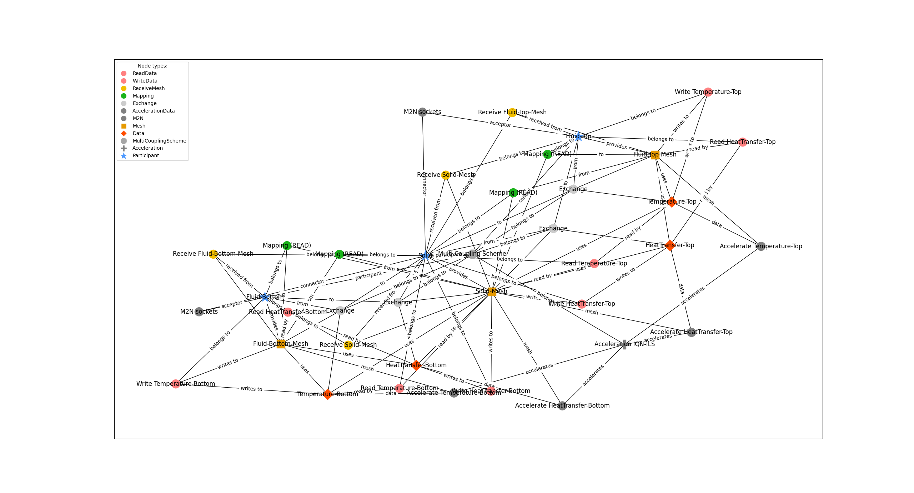

This expert example is identical example to example 5, but its acceleration contains more complex settings like filters, max-used iterations, preconditioner etc.

Inspired by: https://github.com/precice/tutorials/tree/develop/heat-exchanger-simplified

